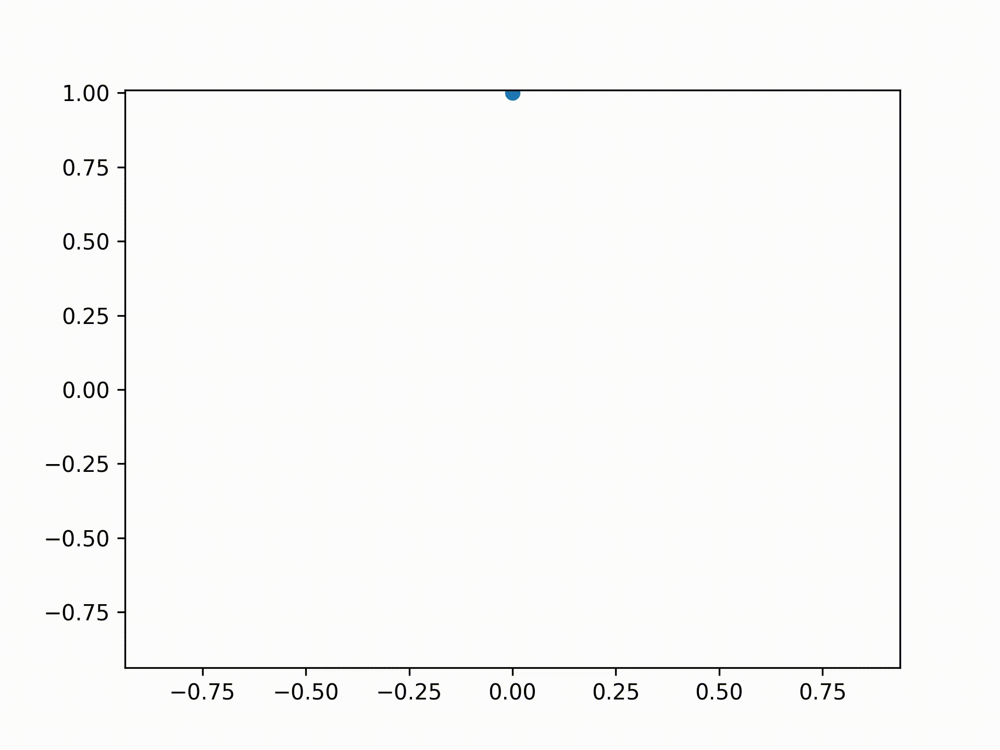

# adaptive

Adaptive sampling of functions in Rust. Inspired by [python-adaptive](https://github.com/python-adaptive/adaptive).

How it works
-------------

Repeat until satisfied:
1. Sample both endpoints. Whenever a point is sampled, add it to a running list of all points.
2. Pick the points in the list that are furthest apart (Euclidean distance, but can choose another metric), and sample in between those two points.
